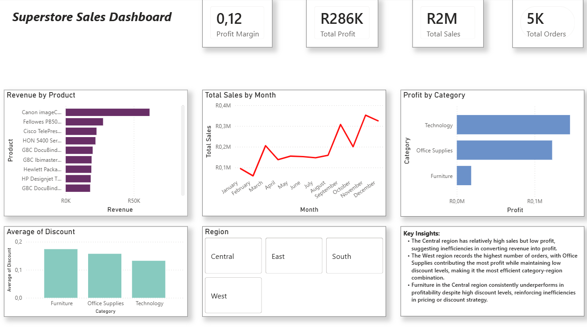

# FUTURE_DS_01
# Superstore Sales Dashboard | Power BI

## Project Overview

This project is an interactive Power BI dashboard built using the Superstore dataset.

The objective was to analyse sales performance across product categories and regions, identify trends, evaluate business performance, and communicate actionable insights through data visualisation.

This project represents my first end-to-end Power BI dashboard and follows a complete analytics workflow from data preparation to insight generation.

---

## Business Objectives

The dashboard was designed to answer the following questions:

- Which product categories generate the strongest performance?
- Which categories require improvement?
- How do different regions contribute to overall business performance?
- Where are potential inefficiencies affecting results?
- What insights can support better business decisions?

---

## Tools Used

- Power BI Desktop
- Power Query
- DAX (Data Analysis Expressions)

---

## Data Preparation

The dataset was cleaned and prepared before analysis.

Key preparation steps included:

- Data type validation and correction
- Data quality checks
- Measure creation using DAX
- KPI development
- Dashboard structuring and formatting

---

## KPIs

The dashboard includes the following key performance indicators:

- Total Sales
- Total Profit
- Total Orders
- Average Discount

---

## Dashboard Visualisations

### Executive KPIs
Provides an overview of overall business performance.

### Sales Trend Analysis
Tracks sales performance over time.

### Category Performance
Compares sales and profitability across product categories.

### Regional Performance
Evaluates how different regions contribute to business outcomes.

### Discount Analysis
Explores relationships between discounting and business performance.

### Interactive Filters
Allows users to analyse performance by region and category.

---

## Key Insights

### Technology Leads Performance
Technology generated the strongest profitability across all categories.

### Furniture Underperforms
Furniture delivered the lowest profit performance relative to other categories.

### Central Region Opportunity
The Central region produced strong sales but comparatively lower profitability, suggesting opportunities for optimisation.

### West Region Strength
The West region generated the highest order volume and demonstrated strong overall performance.

### Category-Region Variations
Performance differed significantly between categories and regions, highlighting the importance of targeted business strategies.

---

## Dashboard Preview

---

## Key Learnings

This project strengthened my understanding of:

- Power BI dashboard development
- Data modelling concepts
- DAX calculations and KPIs
- Business-focused data storytelling
- Transforming raw data into actionable insights

---

## Future Improvements

Potential enhancements include:

- Advanced DAX measures
- Forecasting and trend projections
- Drill-through pages
- Enhanced tooltip experiences
- Additional business performance metrics

---

## Author

Francis Wande

Aspiring Data Science & Analytics focused on developing practical skills in:
- Data Analytics
- Business Intelligence
- Power BI
- Data Storytelling

Open to feedback and continuous learning.
